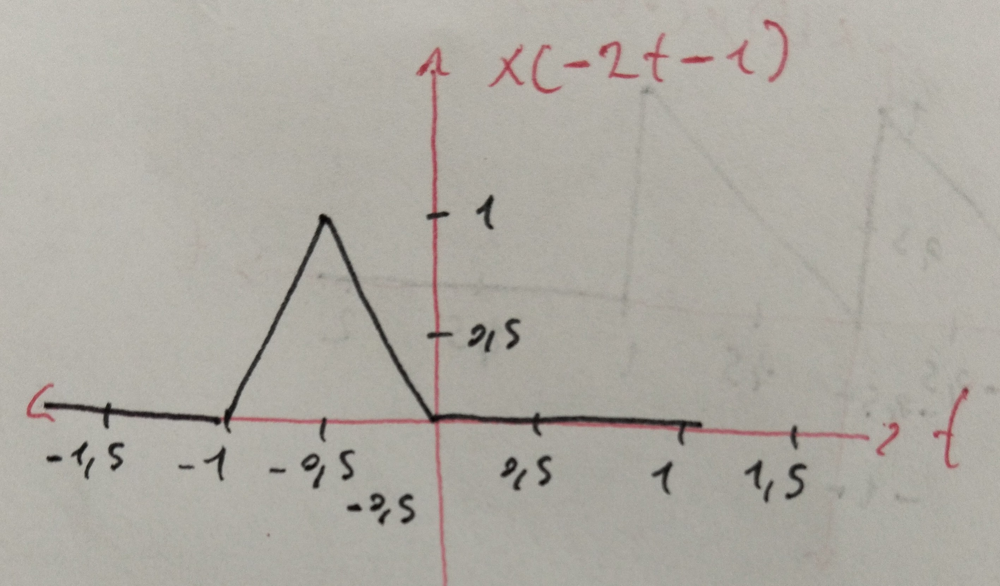
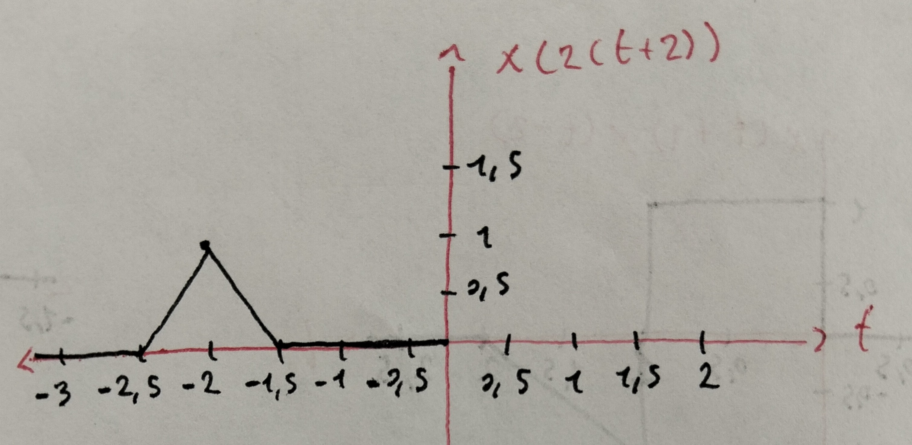
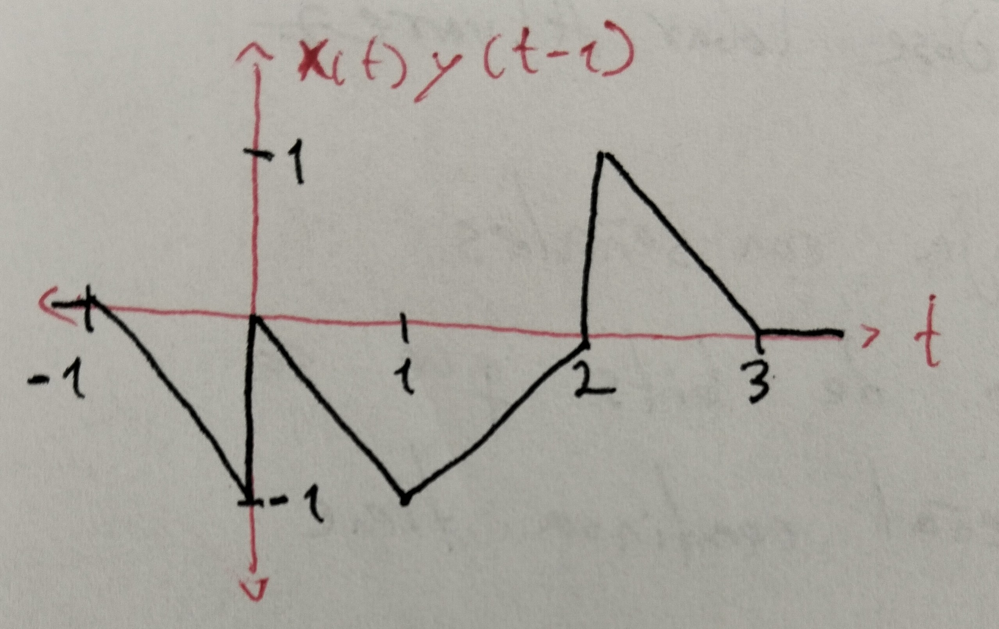
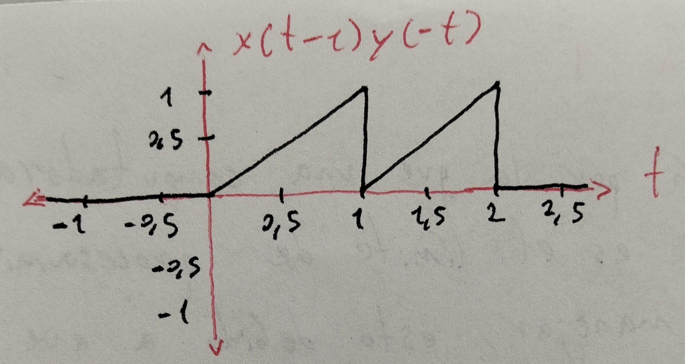

# Laboratorio 1 - Manejo y Gráfica de Funciones
**Asignatura:** Señales y Sistemas 1  
**Integrantes:** [Tu Nombre / Grupo]

---

## Parte 1: Manejo de Funciones

### 1. Serie de Fibonacci
```python
def fibonacci(n):
    if n <= 0: return []
    elif n == 1: return [0]
    fib = [0, 1]
    while len(fib) < n:
        fib.append(fib[-1] + fib[-2])
    return fib
```

### 2. Máximo de tres números
```python
def max_de_tres(a, b, c):
    return max(a, b, c)
```

### 3. Parte Par e Impar de una Señal $x(t)$
Dada una señal $x(t)$, se descompone en:
$$x_p(t) = \frac{x(t) + x(-t)}{2}, \quad x_i(t) = \frac{x(t) - x(-t)}{2}$$

```python
def descomponer_senal(t, x):
    x_reflejada = np.flip(x)
    xp = 0.5 * (x + x_reflejada)
    xi = 0.5 * (x - x_reflejada)
    return xp, xi
```

### 4. Potencia de una Secuencia Periódica
$$P = \frac{1}{N} \sum_{n=0}^{N-1} |x[n]|^2$$

### 5. Energía de una Secuencia Finita
$$E = \sum_{n} |x[n]|^2$$

---

## Parte 2: Graficar Funciones

### 1. Gráfica Polar: $\rho = \sin(2\theta)\cos(2\theta)$


### 2. Solución Ecuación Diferencial: $x(t) = 10e^{-t} - 5e^{-0.5t}$


### 3. Señal Sinusoidal Amortiguada
$$x(t) = 20\sin(2\pi \cdot 1000t - \pi/3)e^{-at}$$

**Conclusión:**
- **Para $t > 0$:** A mayor valor de $a$, la velocidad de decaimiento aumenta y la señal se atenúa más rápido.
- **Para $t < 0$:** A mayor valor de $a$, la señal se amplifica más drásticamente hacia el pasado.

### 4. Secuencia Discreta $w[n]$


### 5. Ondas Periódicas (Cuadrada y Diente de Sierra)



